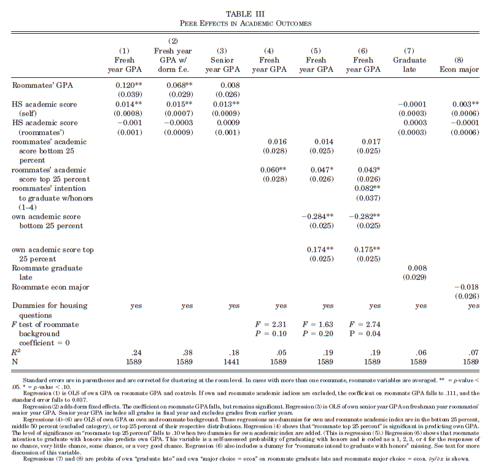
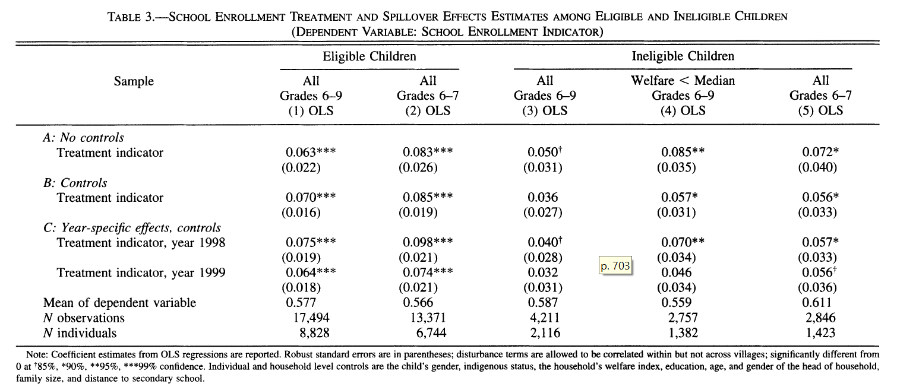
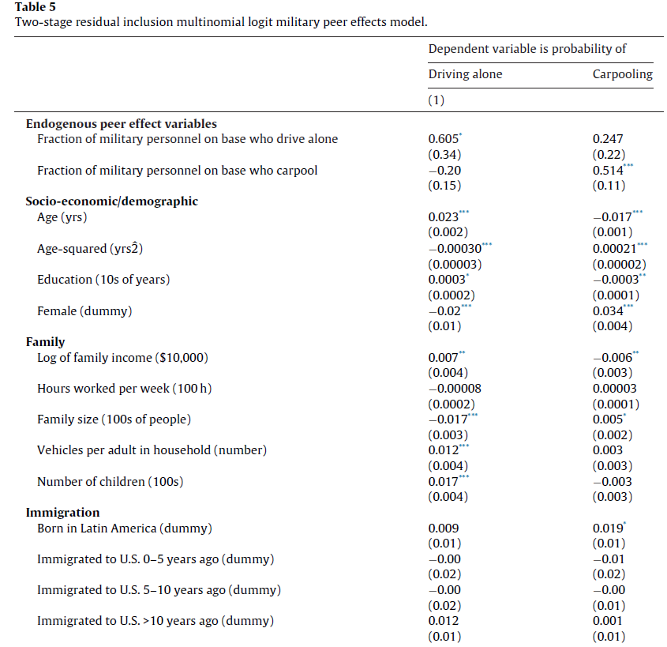

class: title-slide

```{r setup, include=FALSE}
knitr::opts_chunk$set(echo = FALSE, fig.path = "figures/")

library(tidyverse)
library(janitor)
library(sandwich)
library(modelsummary)


xfun::pkg_load2(c('base64enc', 'htmltools', 'mime'))

```

```{css, echo = FALSE}
.huge .remark-code { /*Change made here*/
  font-size: 200% !important;
}
.tiny .remark-code { /*Change made here*/
  font-size: 60% !important;
}

```


.title[
# Clase 28. Modelos de pares
]
.subtitle[
## Econometría II
]
.author[
### Irvin Rojas <br> [rojasirvin.com](https://www.rojasirvin.com/) <br> [<i class="fab fa-github"></i>](https://github.com/rojasirvin) [<i class="fab fa-twitter"></i>](https://twitter.com/RojasIrvin) [<i class="ai ai-google-scholar"></i>](https://scholar.google.com/citations?user=FUwdSTMAAAAJ&hl=en)
]

.affiliation[
### Centro de Investigación y Docencia Económicas <br> División de Economía
]

---

# Motivación

- Hay problemas en los que el comportamiento o los resultados de los pares (*-i*) afectan los resultados de *i*

- Ejemplos

  - Compañeros de clase afectan el proceso de aprendizaje de los demás
  
  - Comportamiento antisocial o disruptivo en adolescentes
  
  - Empresas copian o imitan a sus competidores
  
  - Competencia en un equipo deportivo

---

# Efectos de pares

- Manski (1993) propone una tipología de los *efectos de pares*

- **Efectos endógenos**: se deben a los resultados contemporáneos de los pares

- **Efectos exógenos**: se originan en los contextos de los pares

---

# Modelo lineal en las medias

- Consideremos el siguiente modelo de pares lineal

$$y_i=\alpha+\beta_1 \bar{y}_{-i}+\gamma_1 X_i+\gamma_2 \bar{X}_{-i}+\varepsilon_i$$
- $\bar{y}_{-i}$ es el promedio de la variable de resultados para los pares

- $\bar{X}_{-i}$ es el promedio de las características de los pares

- A las variables construidas como $\bar{z}_{-i}$ a veces se les conoce como *leave-out mean*

- Noten que $\beta_1$ y $\gamma_1$ identifican efectos promedio, independientemente de la posición de $i$ en la distribución de contextos o resultados

---

# Modelo lineal en las medias

- Defectos

  - Poco informativos desde el punto de vista de bienestar pues podemos intercambiar un individuo con $y$ alto y uno con $y$ bajo entre dos grupos y la media quedaría inalterada
  
  - No toma en cuenta posibles no linealidades pues un individuo con alto $y$ se podría beneficiar de pares con alto $y$, pero los individuos con bajo $y$ se pueden ver afectados por individuos con alto $y$
  
---

# Modelos con no linealidades

- Una forma de capturar no linealidades es la propuesta por Duncan et al. (2005) y Sacerdote (2001)

- Cada universitario tiene un compañero de cuarto que puede beber o no

- $Y_i$ es el número de veces que un estudiante bebe en exceso en cierto periodo

- $D_i$ representa beber en exceso en la preparatoria

$$
\begin{aligned}
y_i=\alpha+&\lambda_1(D_i=0))(D_{-i}=0)+\\
&\lambda_2(D_i=1))(D_{-i}=1)+ \\
&\lambda_3(D_i=0))(D_{-i}=1)+\varepsilon_i
\end{aligned}
$$
- $\lambda_2$ identifica si un individuo que bebía en la preparatoria tiene más episodios de ebriedad cuando tiene un compañero que también bebía en la prepaparatoria

---

# Taxonomía de Hoxby & Weingarth (2005)

- Modelo de boutique

  - $i$ se beneficia de la presencia de individuos similares a ella
  
  - Este modelo motivaría la implementación de clases especiales
  

- Modelo arcoiris

  - Todos individuos se benefician de tener pares que son distintos
  

- Modelo de la manzana podrida - estrella

  - La presencia de un individuo con ciertas características puede afectar positiva o negativamente a todos los demas


- Modelo de comparación envidiosa

  - Individuos con resultados altos afectan negativamente a los otros individuos
  
---

# El problema de identificación

- Estimar por MCO el modelo lineal produce estimadores inconsistentes por dos problemas principales (Manski, 1993):

1. **Problema del reflejo**: dado que $i$ afecta a $j$, entonces también $j$ afecta a $i$

  - $\beta_1$ tiene un problema de endogeneidad
  
1. **Efectos correlacionados**: los individuos se seleccionan en grupos (y el econometrista no observa la razón por la que se conforman)

  - $\beta_1$ y $\gamma_2$ están sesgados hacia arriba si hay selección positiva


- Un problema adicional es que casi nunca pueden identificarse por separado $\beta_1$ y $\gamma_2$

---

# Soluciones

- Incluir efectos fijos individuales y/o por grupo para controlar parcialemente la selección

- Encontrar variación exógena a la composición de los grupos

  - Experimentos
  - Variables instrumentales

- Cabe destacar que la mayoría de los estudios no resuelven el problema de identificar por separado $\beta_1$ y $\gamma_2$

- Algunos investigadores recurren al supuesto de que el contexto de $-i$ no afecta directamente al resultado de $i$ (es decir, $\gamma_2=0$)

---

class: inverse, middle, center

# Aplicaciones

---

class: inverse, middle, center

# Efectos de pares con variación aleatoria

---

# ¿Qué tanto importa la calidad de los pares?

- A todos nos dijeron que "el que con lobos anda..."

- Algunos investigadores han cuestionado el efecto de *calidad* de las escuelas y favorecen la hipótesis de que hay efectos mucho mayores provenientes de la calidad de los pares

- Una forma ingenua de responder qué tanta influencia tienen los pares sobre el desempeño propio sería estimar la correlación entre, por ejemplo, calificaciones de un semestre

- Sacerdote (2001) estudió un experimento en el que se asignaron compañeros de cuarto de manera aleatoria, eliminando el problema de selección

- La aleatorización hace que las características de $i$ sean independientes de $-i$

---

# Asignación en dormitorios

- Datos de una universidad en New Hampshire: Dartmouth College

- Los alumnos de nuevo ingreso se asignan con compañeros de cuarto de manera aleatoria

- Variables de resultados
  - Promedio al graduarse
  - Miembro de fraternidades
  - Carrera elegida
  - Participación en atletismo
  - Bebe alcohol

- Variables de contexto
  - Rango de calificación en preparatoria
  - Dummy para preparatoria pública
  - Lugar de nacimiento
  - Índice de logro académico

---

# Modelo de pares con aleatorización

- $y$ es una variable de resultados en la universidad

- Podemos abstraernos de las variables contextuales dada la aleatorización (estas variables solo se usan para mostrar que efectivamente la asignación fue aleatoria)

- La habilidad se observa con ruido: $A_i+\mu_i$

- $A_i$ es el resultado de una prueba académica en la prepa

$$y_i=\delta+\alpha(A_i+\mu_i)+\beta(A_j+\mu_j)+\gamma y_{j}+\varepsilon_i$$

$$y_j=\delta+\alpha(A_j+\mu_j)+\beta(A_i+\mu_i)+\gamma y_{i}+\varepsilon_j$$


- Sustituyendo la segunda ecuación en la primera y resolviendo para $y_i$ se obtiene una relación de forma reducida para el resultado $y_i$ en función de la habilidad de $i$ y $j$

$$y_i=\left(\frac{1}{1-\gamma^2}\right)\left((1+\gamma)\delta+(\alpha+\gamma\beta)A_i+(\beta+\gamma\alpha)A_j+(\alpha+\gamma\beta)\mu_i+(\beta+\gamma\alpha)\mu_j+\gamma\varepsilon_j+\varepsilon_i \right)$$
---

# Modelo de pares con aleatorización

- Esta forma reducida puede reescribirse como

$$y_i=\pi_0+\pi_1 A_i+\pi_2A_j + \eta_i$$

- $A_j$ es la variable de contexto

- Se puede estimar la ecuación anterior por MCO

- $\pi_1$ y $\pi_2$ son los efectos de forma reducida del contexto propio y del contexto del par

- $\pi_2$ no está contaminado por la selección debido a la aleatorización

---

# Resultados

```{r, out.width="70%",fig.cap='Fuente: Sacerdote (2001)',fig.align='center'}

```

---

# Resultados

- El coeficiente sobre las calificaciones del roommie en la columna (1) no puede tener interpretación de efecto de par por el problema de reflejo y por choques comunes aunque se interpretan como evidencia de efectos de pares

  - Bajo asignación aleatoria, se espearía que las calificaciones de $i$ y $j$ no estuvieran correlacionadas

- Al incluir efectos fijos por dormitorio se mitiga el problema de los choques comunes, como en la columna (2)

- En ninguna especificación parece haber un efecto de par contextual (de la habilidad del roommie) en las calificaciones

- La columna (4) muestra que los efectos de pares están presentes cuando el roommie tiene una habilidad en el top 25%

- La columna (5) muestra el efecto de la habilidad propia

---

class: inverse, middle, center

# Efectos de pares en la localidad

---

# Efectos de pares en el contexto del PROGRESA


- Bobonis y Finan (2009) estudian el efecto de las decisiones de otros niños en la comunidad en la decisión propia de ir a la secundaria

  - Complementariedades en la función de producción de educación
  - Normas sociales y presión para no desviarse
  - Cambios en el costo de ir a la escuela

- La decisión de un individuo está dada por

$$y_{ic}=\alpha+\beta X_{ic}+\gamma \bar{X}_c + \lambda Z_c + \theta\bar{y}_c+u_{ic}$$

- $y_{ic}$ es la decisión del individuo $i$ que vive en la localidad $c$ por lo que $y_c$ es el promedio de niños en el grupo de referencia que asisten a la secundaria

- $\gamma$ es el efecto de par contextual y $\theta$ es el efecto endógeno

- Problema con MCO: el reflejo

---

# La asignación de PROGRESA

- El programa se asignó de manera aleatoria a nivel localidad

- Solo los hogares considerados como pobres eran elegibles para el programa

- Los niños que reciben el programa tienen como ecuación de inscripción a secundaria


$$y_{ic}^E=\alpha+\beta X_{ic}^E+\gamma \bar{X}_c + \lambda Z_c + \theta\bar{y}_c + \delta T_{ic}^E +u_{ic}^E$$
- Los individuos que no reciben el programa deciden de acuerdo a

$$y_{ic}^{NE}=\alpha+\beta X_{ic}^{NE}+\gamma \bar{X}_c + \lambda Z_c + \theta\bar{y}_c +  +u_{ic}^{NE}$$
- Notemos que por definición las medias de asistencia y de las variables exógenas son

$$\bar{y}_c=m_c^E\bar{y}_c^E+(1-m_c^E)\bar{y}_c^{NE}$$
$$\bar{X}_c=m_c^E\bar{X}_c^E+(1-m_c^E)\bar{X}_c^{NE}$$
---

# Formas reducidas

- Usando estas definiciones, se puede encontrar una forma reducida para el promedio de asistencia a la secundaria

$$\bar{y}_c=\frac{\alpha}{1-\theta}+\frac{\beta+\gamma}{1-\theta}\bar{X}_c+\frac{\lambda}{1-\theta}Z_c+\frac{\delta}{1-\theta}m_c^ET_c$$
- Y al sustituir esta expresión en la ecuación para $y_{ic}^{NE}$ y después de reordenar obtenemos

$$y_{ic}^{NE}=\frac{\alpha}{1-\theta}+\beta X_{ic}^{NE}+\frac{\theta \beta+\gamma}{1-\theta} \bar{X}_c + \frac{\lambda}{1-\theta} Z_c  + \frac{\theta \delta}{1-\theta}m_c^ET_c +u_{ic}^{NE}$$

- Si pudiéramos estimar estas dos ecuaciones y calculáramos la razón de los coeficientes estimados asociados a $m_c^ET_c$ podemos recuperar $\theta$

- ¿En dónde hemos visto algo parecido, la razón de dos coeficientes teniendo una interpretación causal?

---

# Identificación por VI

- Noten que la ecuación para $y_{ic}^{NE}$ luce como una forma reducida: la variable de interés en función de variables exógenas y un instrumento, $T_c$

- Por otro lado, la ecuación para $\bar{y}_c$ luce como una primera etapa

- La estructura del modelo lleva a los a autores a estimar la siguiente ecuación por VI


$$y_{ic}^{NE}=\alpha+\beta X_{ic}^{NE}+\gamma \bar{X}_c + \lambda Z_c + \theta\bar{y}_{-i,c}   +u_{ic}^{NE}$$
donde $\bar{y}_{-i,c}$ se instrumenta con $T_c$

- Requerimos que

  - $T_c$ esté correlacionada con $y_{ic}^{NE}$
  - $T_c$ no esté corelacionada con $u_{ic}^{NE}$
  
---

# Resultados

```{r, out.width="100%",fig.cap='Bobonis y Finan (2009)',fig.align='center'}

```

---

# Resultados

- Un incremento de 1 punto porcentual en la tasa de asistencia a la secundaria en la localidad incrementa en 0.65 puntos porcentuales la probabilidad de que una niña o niño asista a la secundaria

- El efecto es mayor (0.67 pp) cuando se trata de niñas o niños por debajo de la mediana en el índice de pobreza

- Hay una buena primera etapa: coeficientes robustos a diversas especificaciones y valores del estadístico $F$ entre 7.6 y 13.9

- Noten que parece ser que MCO sesga los efectos estimados hacia arriba


---

class: inverse, middle, center

# Variables instrumentales y efectos de pares

---

# Efectos de pares en el modo de transporte

- Nos interesa conocer el efecto que tienen los pares en la elección del modo de transporte para ir a trabajar

- Morrison y Lin Lawell (2016) identifican el efecto de pares sin hacer supuestos sobre la estructura de la decisión

- Formulamos la probabilidad de escoger un modo de transporte $j$ como

$$P(a_{it}=j)=\frac{exp\{\eta_{it}'\beta_j+X_{it}'\gamma_j\}}{\sum_{j=0}^2exp\{\eta_{it}'\beta_j+X_{it}'\gamma_j\}}$$
- Nos interesa

  - $a_{it}=1$ cuando la persona $i$ maneja sola
  - $a_{it}=2$ cuando la persona $i$ comparte el auto
  - $a_{it}=0$ cuando la persona $i$ no usa auto

- $\eta_{it}$ es la proporción de personas en el mismo trabajo que comparten el auto

- Los autores usan datos de personal militar que trabaja en bases militares

---

# Identificación

- Sabemos que MCO ignora

  - Problema del reflejo
  - Choques que afectan a $i$ y $j$ al mismo tiempo y que pueden estar correlacionados con $a_i$ y $a_j$
  - Selección en grupos
  
- Identificación por VI

- Se documenta que las personas nacidas en Latinoamérica manejan solas (sin compartir el auto) en mayor proporción que la población de los EUA y que los inmigrantes comparten el auto más que la población general

- Se puede instrumentar $\nu_{it}$ usando la proporción de trabajadores en cada base militar que nació en Latinoamérica y la proporción de trabajadores inmigrantes en los últimos 5 a 10 años

- Estimación por inclusión de residuales en dos etapas (Terza et al., 2008)

  - Estimar la primera etapa y obtener los residuales
  - Incluir los residuales en el logit multinomial de la segunda etapa

---

# Resultados

.pull-left[
- Un incremento de 10 puntos porcentuales en la proporción de pares que maneja sin acompañante incrementa 6.05 puntos porcentuales la propia probabilidad de manejar sin acompañante

- Un incremento de 10 puntos porcentuales en la proporción de pares que comparte el auto incrementa en 5.14 puntos porcentuales la probailidad propia de compartir el auto
]

.pull-right[
```{r, out.width="100%",fig.cap='Morrison y Lin Lawell (2016)',fig.align='center'}

```
]


---

# Conclusión

- Los efectos de pares surgen en muchos de los problemas económicos de interés

- Mucha atención se le ha puesto el contexto de la educación, pero son ingrediente clave en

  - Lugar de trabajo
  - Equipos deportivos
  - Órganos colegiados

- La identificación por variación experimental puede ser

  - Costosa
  - No ética
  - Poco práctica
  
- Frecuentemente se recurre a supuestos para darle estructura al problema y establecer las condiciones de identificación

---

# Próxima sesión

- Será anunciada

---

class: center, middle

Presentación creada usando el paquete [**xaringan**](https://github.com/yihui/xaringan) en R.

El *chakra* viene de [remark.js](https://remarkjs.com), [**knitr**](http://yihui.org/knitr), y [R Markdown](https://rmarkdown.rstudio.com).

Material de clase en versión preliminar.

**No reproducir, no distribuir, no citar.**
